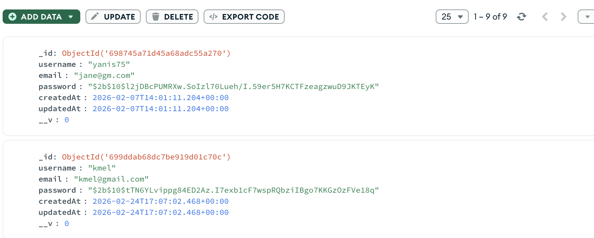

# Buzzer Beater — Compte Rendu de Projet

**Module : Programmation Web — APP3**
**Année : 2025-2026**

---

**Membres de l'équipe :**

| Nom | Prénom |
|-----|--------|
| Metari | Yanis |
| Dindanda Matondo | Christopher |

**Nom du projet :** Buzzer Beater
**Date de rendu :** 26 février 2026

---

## Table des matières

1. [Contexte](#1-contexte)
2. [Planification](#2-planification)
   - 2.1 [Répartition des rôles](#21-répartition-des-rôles)
   - 2.2 [Compétences et nouvelles technologies](#22-compétences-et-nouvelles-technologies)
   - 2.3 [Cahier des charges](#23-cahier-des-charges)
   - 2.4 [Planning prévisionnel et réalisé](#24-planning-prévisionnel-et-réalisé)
3. [Description du développement](#3-description-du-développement)
   - 3.1 [Technologies utilisées](#31-technologies-utilisées)
   - 3.2 [Étapes et tâches](#32-étapes-et-tâches)
   - 3.3 [Difficultés rencontrées et solutions](#33-difficultés-rencontrées-et-solutions)
   - 3.4 [État du projet](#34-état-du-projet)
4. [Mise en production](#4-mise-en-production)
5. [Conclusion et bilan réflexif](#5-conclusion-et-bilan-réflexif)
6. [Annexes](#6-annexes)

---

## 1. Contexte

### Présentation du projet

**Buzzer Beater** est un site web dédié à la NBA (National Basketball Association), la ligue de basketball professionnelle américaine. Son objectif est de regrouper en un seul endroit les informations essentielles pour les passionnés : actualités, fiches d'équipes, carte interactive des terrains de basketball, et une communauté via un forum.

### Motivation et choix du sujet

Le projet est né d'un intérêt commun pour le basketball et le sport en général. En observant que les informations NBA en français sont souvent dispersées sur plusieurs sites, nous avons voulu concevoir une plateforme centralisée, en français, offrant une expérience cohérente et agréable. Le nom « Buzzer Beater » — terme désignant un panier marqué à la dernière seconde — pour representer la passion que nous voulons transmettre.

### Contexte d'usage

Le site s'adresse principalement à des fans de la NBA francophones souhaitant :
- Suivre les actualités NBA en temps réel
- Consulter les fiches détaillées des 30 équipes de la ligue
- Trouver des terrains de basketball à proximité via une carte interactive
- Partager leur passion au sein d'une communauté via le forum

L'ensemble du site est conçu pour fonctionner en local (client et serveur), sans nécessité d'hébergement externe pour la démonstration.

---

## 2. Planification

### 2.1 Répartition des rôles

Le projet a été développé en binôme, avec une répartition semi-spécialisée :

| Membre | Responsabilités principales |
|--------|-----------------------------|
| Yanis | Back/Front (API Node.js/Express, MongoDB), module carte (map_bb backend), intégration React, architecture de la base de données,navbar,login  |
| Christopher | Front/Back (HTML/CSS/JS), pages statiques (accueil, équipes, actualités), intégration RSS, mise en forme responsive, forum |

Les décisions (choix des frameworks, structure du projet, modèles de données) ont été validé conjointement.

### 2.2 Compétences et nouvelles technologies

| Membre | Technologies déjà maîtrisées | Technologies abordées pour la première fois |
|--------|-------------------------------|---------------------------------------------|
| Yanis | HTML, CSS, JavaScript, bases Git | Node.js, Express.js, MongoDB/Mongoose, React, Vite, Mapbox GL |
| Christopher | HTML, CSS, JavaScript, bases Git | Node.js, API REST, MongoDB, intégration RSS, React, gestion de session cross-origin |

### 2.3 Cahier des charges

#### Exigences fonctionnelles

| ID | Fonctionnalité | Priorité | État |
|----|----------------|----------|------|
| F01 | Page d'accueil avec présentation du site | Haute | ✅ Réalisé |
| F02 | Agrégateur d'actualités NBA (RSS) | Haute | ✅ Réalisé |
| F03 | Encyclopédie des 30 équipes NBA | Haute | ✅ Réalisé |
| F04 | Inscription et connexion utilisateur | Haute | ✅ Réalisé |
| F05 | Carte interactive des terrains de basketball | Haute | ✅ Réalisé |
| F06 | Ajout/consultation de pins sur la carte | Haute | ✅ Réalisé |
| F07 | Forum communautaire (posts + réponses) | Moyenne | ✅ Réalisé |
| F08 | Gestion de session unifiée (navbar auth) | Haute | ✅ Réalisé |
| F09 | Section résultats / scores NBA | Basse | ❌ Non réalisé (temps) |
| F10 | Mode sombre / clair | Basse | ❌ Non réalisé (technique et mise en place) |

#### Exigences techniques

| ID | Contrainte | État |
|----|------------|------|
| T01 | Site avec front-end et back-end | ✅ Réalisé |
| T02 | Site dynamique (local + serveur) | ✅ Réalisé |
| T03 | Utilisation d'au moins un framework | ✅ React + Express |
| T04 | Base de données | ✅ MongoDB (Atlas) |
| T05 | Design responsive | ✅ Réalisé |
| T06 | Code commenté et organisé | ✅ Réalisé |
| T07 | Documentation technique | ✅ Réalisé (dossier `docs/`) |

#### Exigences non fonctionnelles
- Accessibilité : Attributs `alt` sur les images, navigation clavier, contrastes suffisants


### 2.4 Planning prévisionnel et réalisé

#### Planning prévisionnel

| Période | Tâches prévues |
|---------|----------------|
| Semaine 1 (Dec.) | Choix du sujet, définition des fonctionnalités, maquettes |
| Semaine 2 | Mise en place de l'environnement (Git/Node.js), création de la structure HTML/CSS de base |
| Semaine 3 | Développement du front-end (accueil, actualités) |
| Semaine 4 | Développement back-end (API, base de données MongoDB, modèles) |
| Semaine 5 | Page équipes, intégration RSS |
| Semaine 6 (fév.) | Module carte (React + Mapbox) |
| Semaine 7 | Authentification utilisateur, connexion front/back géneralisation du caractere responsive du site  |
| Semaine 8 | Tests, corrections, forum (si temps) |
| Semaine 9 | Finalisation, rapport, préparation de la soutenance |


## 3. Description du développement

### 3.1 Technologies utilisées

#### Front-end (site principal)

| Technologie | Justification |
|-------------|---------------|
| **HTML** | Structure des pages, accessibilité native (`<nav>`, `<article>`, `<section>`, etc.) |
| **CSS** | Styling avancé : variables CSS, effets glassmorphism/Parralax, media queries pour le responsive, animations |
| **JavaScript** | Interactions dynamiques côté client : parsing RSS, validation de formulaires en temps réel, gestion de session , fetch API|
| **Font Awesome (CDN)** | Bibliothèque d'icônes légère et facile à intégrer |

Nous avons choisi de ne pas utiliser de framework CSS (comme Bootstrap ou Tailwind) pour le site principal afin d'avoir un contrôle total sur le design et d'en apprendre davantage sur le CSS pur (On a rien trouvé à notre goût aussi).

#### Back-end (API REST)

| Technologie | Justification |
|-------------|---------------|
| **Node.js** | Runtime JavaScript côté serveur, cohérence avec le front-end |
| **Express.js (v5)** | Framework minimaliste pour créer des routes RESTful rapidement |
| **MongoDB (Atlas)** | Base de données NoSQL adaptée aux données semi-structurées (pins avec coordonnées, profils utilisateurs, posts imbriqués) |
| **Mongoose** | ODM pour MongoDB, schémas de données clairs et validation intégrée |
| **bcryptjs** | Hashage des mots de passe (version pure JS, sans dépendances natives) |
| **dotenv** | Gestion des variables d'environnement (clés API, URL de base de données) |
| **CORS** | Gestion des requêtes cross-origin entre front-end (port 5173), site statique (port 3000) et requêtes `file://` |

#### Module carte (map_bb)

| Technologie | Justification |
|-------------|---------------|
| **React (v19)** | Framework JavaScript déclaratif, idéal pour une interface interactive comme une carte avec état (pins, popups, authentification) |
| **Vite** | Outil de build rapide avec Hot Module Replacement (HMR) pour le développement |
| **Mapbox GL / react-map-gl** | Bibliothèque de cartographie interactive puissante, personnalisable, avec une API bien documentée |
| **Material-UI (MUI)** | Composants React prêts à l'emploi pour les formulaires et les popups |
| **Axios** | Client HTTP pour les appels à l'API back-end |

### 3.2 Étapes et tâches

#### Structure du projet

```
Buzzer_Beater/
├── pgs_prjts/            ← Pages HTML du site
│   ├── bb_menu.html      ← Page d'accueil
│   ├── bb_news.html      ← Actualités NBA (RSS)
│   ├── bb_teams.html     ← Encyclopédie des 30 équipes
│   ├── bb_forum.html     ← Forum communautaire
│   ├── login.html        ← Connexion utilisateur (connectée à l'API)
│   └── register.html     ← Inscription utilisateur (connectée à l'API)
├── imgs_prjt/            ← Images et ressources visuelles
│   ├── logo_bb.png
│   ├── basket_stade.jpg
│   ├── balgris.png
│   └── Parallax/         ← Fonds d'équipes NBA (effets parallaxe)
├── navbar-auth.js        ← Gestion auth partagée toutes pages
├── style_teams.css       ← Feuille de style principale
├── map_bb/
│   ├── backend_map/
│   │   ├── index.js      ← CORS multi-origines, express.static, forum route
│   │   ├── models/
│   │   │   ├── User.js
│   │   │   ├── Pin.js
│   │   │   └── Post.js   ← Modèle forum
│   │   └── routes/
│   │       ├── users.js
│   │       ├── pins.js
│   │       └── forum.js  ← Routes forum CRUD
│   └── frontend_map/
│       └── src/
│           ├── App.jsx   ← Auth URL params, protection carte, navbar
│           ├── app.css
│           └── components/
│               ├── Login.jsx
│               └── Register.jsx
└── Projet_Consigne/
```


#### Page d'accueil (`bb_menu.html`)

La page d'accueil présente :
- Une barre de navigation responsive avec menu hamburger (mobile)
- Un hero section avec le logo et le slogan
- Une grille de 4 cartes de fonctionnalités principales
- Un aperçu des 3 dernières actualités (chargées via RSS)
- Un carousel de 8 équipes NBA en vedette
- Un lien vers le forum communautaire
- Un footer avec liens de navigation
- Affichage dynamique du nom d'utilisateur connecté dans la navbar (via `navbar-auth.js`)

#### Page actualités (`bb_news.html`)

La page actualités récupère dynamiquement les articles NBA depuis le flux RSS de **RMC Sport** (`rmcsport.bfmtv.com/rss/basket/nba/`) via un proxy CORS ([corsproxy.io](https://corsproxy.io)).

Le flux XML est parsé en JavaScript natif avec `DOMParser`, et les articles sont affichés sous forme de cards avec : titre, description, image, date de publication et lien vers l'article source.

#### Page équipes (`bb_teams.html`)

Cette page répertorie les 30 équipes NBA avec pour chacune :
- Localisation et surnom
- Contexte historique et informations générales (2-3 paragraphes)
- Effectif actuel (cinq majeur)
- Image de fond en effet parallaxe

#### Authentification (`login.html` / `register.html`)

**Inscription :**
- Validation en temps réel : format email (indicateur ✓/✗), longueur du pseudo, confirmation du mot de passe
- Bascule affichage/masquage du mot de passe
- Soumission via `fetch API` vers `POST /api/users/register`
- Redirection automatique vers `login.html` après succès

**Connexion :**
- Soumission via `fetch API` vers `POST /api/users/login`
- Stockage du nom d'utilisateur dans `localStorage` (origine `localhost:3000`)
- Redirection vers la map (`localhost:5173?user=USERNAME`) avec passage de session via paramètre URL

**Back-end :**
- Le mot de passe est hashé avec `bcryptjs` avant stockage
- La connexion vérifie le hash avec `bcrypt.compare()`

#### Gestion de session unifiée (`navbar-auth.js`)

Un script partagé inclus dans toutes les pages statiques gère l'état d'authentification de façon cohérente :
- Détecte `localStorage.getItem('user')` au chargement de chaque page
- Si connecté : remplace le lien « Connect » par le nom d'utilisateur + bouton de déconnexion
- Si déconnexion depuis la map React (`?logout=1`) : vide le `localStorage` côté site statique
- Si arrivée depuis la map avec session (`?user=USERNAME`) : stocke la session côté site statique

Ce mécanisme résout le problème fondamental de l'architecture hybride : deux origines différentes (`localhost:3000` et `localhost:5173`) ont des `localStorage` isolés. La synchronisation se fait par passage de paramètre URL.

#### Schéma des modèles MongoDB

**Modèle User :**
```
User {
  username : String (unique, requis, 3-20 car.)
  email    : String (unique, requis, max 60 car.)
  password : String (requis, hashé bcryptjs, min 6 car.)
  createdAt / updatedAt : Date (auto)
}
```

**Modèle Pin (terrain de basketball) :**
```
Pin {
  username : String (requis) — créateur du pin
  title    : String (requis) — nom du lieu
  desc     : String (requis) — avis / description
  rating   : Number (requis, 0-5) — note du terrain
  lat      : Number (requis) — latitude
  long     : Number (requis) — longitude
  createdAt / updatedAt : Date (auto)
}
```

**Modèle Post (forum) :**
```
Post {
  username : String (requis) — auteur du post
  title    : String (requis, max 150 car.)
  content  : String (requis)
  replies  : [Reply] — tableau de documents imbriqués
    └── Reply {
          username : String (requis)
          content  : String (requis)
          createdAt / updatedAt : Date (auto)
        }
  createdAt / updatedAt : Date (auto)
}
```

#### Forum communautaire (`bb_forum.html`)

Le forum est une page HTML servie depuis `localhost:3000`, connectée à l'API via `fetch` :

- **Lecture** : chargement de tous les posts au démarrage (`GET /api/forum/posts`)
- **Écriture** : formulaire de création de post visible uniquement si connecté
- **Réponses** : chaque post dispose d'un champ de réponse inline (`POST /api/forum/posts/:id/reply`)
- **Suppression** : bouton supprimer visible uniquement sur ses propres posts (`DELETE /api/forum/posts/:id`)
- **Protection XSS** : tous les contenus affichés sont échappés via `escHtml()` avant insertion dans le DOM

#### Module carte (`map_bb`)

Le module carte est une application React (Vite) qui :
- Affiche une carte interactive Mapbox centrée sur Paris
- Récupère tous les pins depuis l'API (`GET /api/pins`) et les affiche
- **Protège** l'ajout de pins : double-clic sans être connecté ouvre le modal de login au lieu du formulaire de pin
- Lit le paramètre `?user=USERNAME` depuis l'URL pour récupérer la session depuis le site statique
- Affiche dans la navbar : bouton Accueil, bouton Forum (avec passage du `?user=`), nom d'utilisateur, bouton déconnexion
- La déconnexion vide le `localStorage` React et redirige vers `localhost:3000/pgs_prjts/login.html?logout=1`

### 3.3 Difficultés rencontrées et solutions

#### Problème CORS avec le flux RSS

**Problème :** Le flux RSS de RMC Sport ne peut pas être directement requis depuis un navigateur.

**Solution choisie :** Proxy public `corsproxy.io`.

**Limitation :** Dépendance à un service tiers. La solution idéale serait un endpoint back-end `/api/news` qui met en cache le flux côté serveur.

#### Apprentissage de React et Mapbox

**Problème :** Aucun membre de l'équipe n'avait utilisé React ou Mapbox auparavant.

**Solution :** Documentation officielle, tutoriels YouTube. Environ une semaine de montée en compétence.

#### Synchronisation de session entre deux origines

**Problème :** `localStorage` est isolé par origine. Un utilisateur connecté sur `localhost:3000` n'est pas connu de `localhost:5173`, et vice-versa.

**Solution :** Passage par paramètre URL :
1. `pgs_prjts/login.html` redirige vers `localhost:5173?user=USERNAME` → React lit et stocke dans son `localStorage`
2. Map React redirige vers `localhost:3000/pgs_prjts/bb_forum.html?user=USERNAME` → `navbar-auth.js` lit et stocke
3. Déconnexion React redirige vers `localhost:3000/pgs_prjts/login.html?logout=1` → `navbar-auth.js` vide le `localStorage` des deux côtés

#### `bcrypt` non compilable sur Windows

**Problème :** `bcrypt` (version native C++) échouait à la compilation sur l'environnement de développement Windows.

**Solution :** Remplacement par `bcryptjs` (implémentation pure JavaScript, API identique, aucune dépendance native).

#### Gestion des variables d'environnement

**Problème :** Les tokens Mapbox et l'URL MongoDB doivent rester secrets.

**Solution :** Fichiers `.env` non versionnés. Variables exposées côté client React via le préfixe `VITE_` et côté serveur via `dotenv`.

### 3.4 État du projet

#### Fonctionnalités complètes

- ✅ Page d'accueil avec navigation responsive
- ✅ Agrégateur d'actualités NBA (RSS dynamique)
- ✅ Encyclopédie des 30 équipes NBA
- ✅ Inscription avec validation en temps réel, connectée à l'API
- ✅ Connexion avec vérification bcryptjs, connectée à l'API
- ✅ API REST (Express) pour utilisateurs, pins et forum
- ✅ Base de données MongoDB (modèles User + Pin + Post)
- ✅ Module carte interactif (Mapbox + React)
- ✅ Ajout et consultation de pins de terrains (protégés par authentification)
- ✅ Forum communautaire (posts, réponses, suppression)
- ✅ Gestion de session unifiée sur toutes les pages (`navbar-auth.js`)
- ✅ Déconnexion synchronisée entre la map React et le site statique


#### Fonctionnalités incomplètes / défauts connus

- ⚠️ **Page équipes** : Générée en HTML statique plutôt que dynamiquement depuis la base de données
- ⚠️ **Session JWT** : Authentification basée sur `localStorage` + paramètre URL ; une implémentation JWT côté back-end renforcerait la sécurité
- ❌ **Section résultats** : Non implémentée
- ❌ **Mode sombre** : Prévu mais non implémenté

#### Améliorations proposées


1. **Génération dynamique des équipes** : Stocker les données en MongoDB et les servir via l'API
2. **Tests** : Ajouter des tests
3. **Déploiement** : Héberger le back-end et le front-end


## 4. Mise en production

### Configuration locale (pour faire tourner le projet)

#### Démarrage manuel étape par étape

**1. Back-end API (`map_bb/backend_map`) :**
```bash
cd map_bb/backend_map
npm install
# Créer .env avec : Mongo_Url=mongodb+srv://...
node index.js
# → MongoDB connected!
# → Backend server is running! (port 3000)
```

**2. Front-end carte (`map_bb/frontend_map`) :**
```bash
cd map_bb/frontend_map
npm install
# Créer .env avec : VITE_MAPBOX=pk.eyJ1...
npm run dev 
# → VITE ready at http://localhost:5173/
```

**3. Site principal :** Accessible sur `http://localhost:3000/pgs_prjts/bb_menu.html`.

#### URLs d'accès

| URL | Page |
|-----|------|
| `http://localhost:3000/pgs_prjts/bb_menu.html` | Accueil |
| `http://localhost:3000/pgs_prjts/login.html` | Connexion |
| `http://localhost:3000/pgs_prjts/register.html` | Inscription |
| `http://localhost:3000/pgs_prjts/bb_forum.html` | Forum |
| `http://localhost:5173` | Map interactive |


## 5. Conclusion et bilan réflexif

### État global du projet

Le projet **Buzzer Beater** est fonctionnel dans l'ensemble de ses fonctionnalités prévues. Le site présente une interface stylisé, un contenu dynamique (actualités RSS, carte interactive), une API opérationnelle, une base de données connectée, un forum communautaire et un système d'authentification unifié entre les différentes parties du site.

L'architecture finale, bien que complexe dans sa gestion, est cohérente. La séparation front/back est claire, les modèles de données bien définis, et les scripts de démarrage facilitent la prise en main.

### Bilan personnel — Yanis

Ce projet m'a permis de franchir une étape importante dans ma progression en développement web. L'apprentissage de Node.js et Express a été enrichissant : j'ai compris les mécaniques d'une API REST, la gestion des routes, des middlewares et de l'authentification. Travailler avec MongoDB m'a donné une première expérience avec les bases de données NoSQL.

La partie qui m'a le plus apporté est le module carte : React m'a obligé à penser différemment (composants, état, cycle de vie) et Mapbox m'a ouvert à l'intégration d'APIs tierces complexes.
### Bilan personnel — Christopher

Ce projet a été ma première expérience de développement web sur un projet de cette envergure. J'ai particulièrement progressé en CSS avancé (variables, glassmorphism, responsive), en JavaScript côté client ( fetch API, validation de formulaires, gestion de `localStorage`), et en architecture web (comprendre comment un front-end statique communique avec un back-end via une API REST).

La gestion de session a été le défi le plus complexe : comprendre pourquoi deux serveurs différents (même en local) ne partagent pas leur `localStorage` et essayé concevoir un mécanisme de passage par paramètre URL a demandé une vraie réflexion sur les bases du web.

Si je refaisais le projet, je commencerais par établir une maquette plus précise et un cahier des charges plus rigoureux, pour éviter les allers-retours sur le design en fin de projet.

### Réflexion sur l'usage de l'IA

Des outils d'IA (principalement **Claude** et **ChatGPT**) ont été utilisés dans le cadre du projet, avec une approche réfléchie :

**Ce qui a bien fonctionné :**
- Débogage rapide : expliquer un message d'erreur incompréhensible et obtenir des pistes de solution
- Aide de l'IA dans la composition du CSS des différents éléments 
- Génération de contenu textuel (descriptions des équipes NBA)
- Généreration du code répétitif.
- Aide à la syntaxe pour des technologies nouvelles (React, Mongoose, fetch API)
- Identification de bugs (`Problème de Session` La map et le forum étaient séparé sans comprendre comment les réunir, `pwdInput` non déclaré)
- Revue et rangement du code et des fichiers

**Ce qui n'a pas bien fonctionné / limites observées :**
- Le code généré n'était pas toujours adapté à notre architecture/OS spécifique (Mac💀 vs Windows🫶🏽)
- Sur des problèmes complexes de CORS ou de configuration, les premières suggestions n'étaient pas toujours correctes
- Le code IA non compris est dangereux : nous avons au maximum veillé à comprendre chaque ligne intégrée

**Réflexion globale :** L'IA est un accélérateur, pas un remplaçant. Elle est utile pour les tâches répétitives ou pour explorer rapidement un nouvel outil. Mais elle ne remplace pas la compréhension.

---

## 6. Annexes

### Annexe A — Bibliographie et ressources utilisées

| Ressource | Usage |
|-----------|-------|
| [Documentation MDN Web Docs](https://developer.mozilla.org) | Référence HTML/CSS/JS |
| [Documentation Express.js](https://expressjs.com) | Routes, middlewares |
| [Documentation Mongoose](https://mongoosejs.com/docs) | Modèles MongoDB |
| [Documentation React](https://react.dev) | Composants, Hooks |
| [Documentation react-map-gl](https://visgl.github.io/react-map-gl/) | Intégration Mapbox |
| [Documentation Mapbox GL JS](https://docs.mapbox.com/mapbox-gl-js/) | API cartographique |
| [corsproxy.io](https://corsproxy.io) | Proxy CORS pour le flux RSS |
| API RSS RMC Sport | Actualités NBA |
| Font Awesome | Icônes |
| MongoDB Atlas | Hébergement base de données |


### Annexe B — Lien vers le dépôt Git

Le code source est disponible sur GitHub : `https://github.com/Yanis-LM5/Buzzer_Beater`

### Annexe C — Illustration MongoDB



---

*Compte rendu rédigé par `Dindanda Christopher` et `Metari Yanis` dans le cadre du module APP3 — Programmation Web, 2025-2026.*
